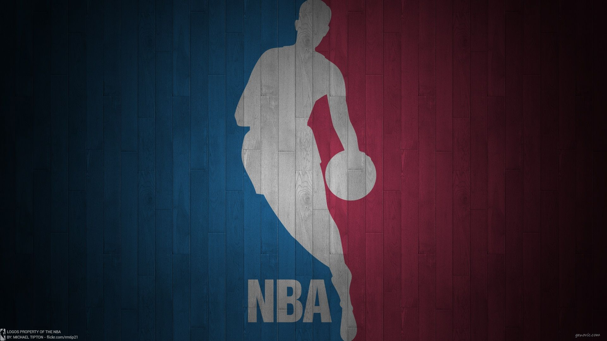

# Ballers - Project 3
#### _By: Vena Li, Sharifah Sinclair, George Redak, Jim Tran_

<h3> Introduction </h3>

Using the data uploaded to SQLite, we will utilize D3.js to create 3 visualizations. The first wil compare two players (user selected from drop down). The second is a multi-line graph showing PER by position (user selects what position(s) to see). The third are a scatter plots showing player statistics (user selects the statistic).  Create an html page to display all the visualization deployed to Heroku.

<h3> Database - SQLite </h3>

Pull data from SQLite.  We initially loaded the source data to MongoDB but was having formatting issues when retrieving from flask-sqlachemy.  In the interest of time we decided to load the data to and retrieved from SQLite.

<h3> Data Munging </h3>

We used python with flask-sqlachemy to retrieve and jsonify all of our data sources for charting/graphing.  Additionally, we built 6 back end API routes along with 6 front end routes to service our charts and graphs; which we used D3.js to build. The standard libraries such as bootstrap, D3 graphing, etc. was used for styling our charts/graphs.

<h3> Graph concepts </h3>

<h4> Scrolly Shot Chart </h4>
First, a scattered chart was built to show the individual players shot ranges.  As you scroll down the page the player is highlighted and their respective shots are displayed.

<h4> Versus Bar Graph </h4>
Next, we display the greatest players of all time (GOAT) in a bar graph that can be filtered by player and their all time statistics will display on the right.

<h4> Historical Win Shares Line Graph </h4>
Next, a line chart is used to show the average win shares by for years from 1980 to 2015; which a dropdown is used to select each position such as, center, point guard, power forward, shoot guard and small forward. An overall view of all the positions is also charted in a multi-line chart.

<h4> Team Stats </h4>
For team stats we used a connected scattered plot to show each stat by team.  A dropdown is used to select each team stat such as points, assists, field goals and rebounds. And when hovered over a tool tip is used to display the values of each stats for each team. A scattered plot is used to display team points to team wins by year.  When hover over the dots, the year cluster is highlighted and each of the team stats is displayed.

<h3> Future Opportunities </h3>

Although we are very pleased with our work and accomplishments in this project; there are definitely opportunities to improve and hence the chart/graphs. We can add more functionality such as more responsive tooltips and data labels in the scatter charts. Moreover, we could explore more visual graphics; such as using more bootstrap and more interactive D3 transitions. However, overall this project was a great start to our website.

